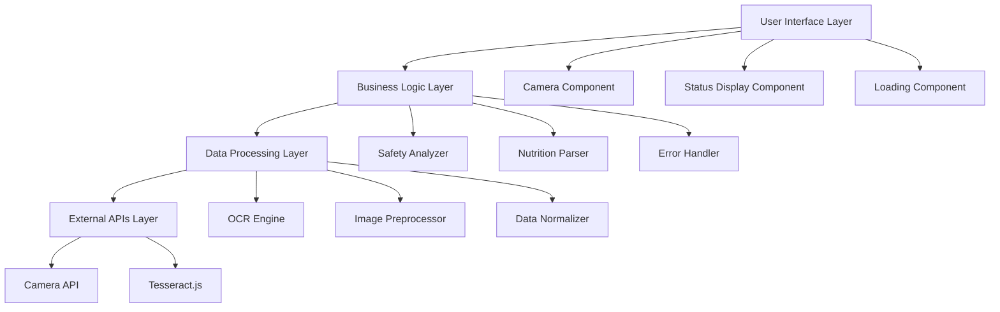

# Design Document: Nutri-Scan App

## Overview

Nutri-Scan is a mobile-responsive web application built with Next.js that helps CKD and diabetes patients make informed dietary choices. The app uses Tesseract.js for client-side OCR processing to scan nutrition labels and provides immediate safety feedback based on sodium, potassium, and sugar content.

The application follows a single-page application (SPA) pattern with a camera-first interface optimized for mobile devices. All processing happens client-side to ensure privacy and offline functionality.

## Architecture

The application uses a modular, component-based architecture built on Next.js with the following key layers:



### Technology Stack
- **Frontend Framework**: Next.js 14 with App Router
- **Styling**: Tailwind CSS for responsive design
- **OCR Engine**: Tesseract.js for client-side text recognition
- **Camera Access**: Web APIs (getUserMedia)
- **State Management**: React hooks (useState, useEffect)
- **Image Processing**: Canvas API for preprocessing

## Components and Interfaces

### Camera Interface Component
```typescript
interface CameraInterfaceProps {
  onCapture: (imageData: string) => void;
  onError: (error: CameraError) => void;
}

interface CameraError {
  type: 'permission_denied' | 'device_not_found' | 'unknown';
  message: string;
}
```

**Responsibilities:**
- Request camera permissions
- Display live camera preview
- Capture photos with optimal settings for OCR
- Handle camera-related errors

### OCR Engine Component
```typescript
interface OCREngineProps {
  imageData: string;
  onComplete: (text: string) => void;
  onProgress: (progress: number) => void;
  onError: (error: OCRError) => void;
}

interface OCRResult {
  text: string;
  confidence: number;
  processingTime: number;
}
```

**Responsibilities:**
- Initialize Tesseract.js worker
- Preprocess images for better OCR accuracy
- Extract text from nutrition label images
- Report processing progress

### Nutrition Parser Component
```typescript
interface NutritionData {
  sodium: NutrientValue | null;
  potassium: NutrientValue | null;
  sugar: NutrientValue | null;
}

interface NutrientValue {
  amount: number; // normalized to mg
  unit: string;
  confidence: number;
  rawText: string;
}
```

**Responsibilities:**
- Parse OCR text for nutrition values
- Extract sodium, potassium, and sugar amounts
- Normalize units to milligrams
- Handle multiple value formats

### Safety Analyzer Component
```typescript
interface SafetyAnalysis {
  overallStatus: 'safe' | 'high_risk';
  nutrients: {
    sodium: NutrientAnalysis;
    potassium: NutrientAnalysis;
    sugar: NutrientAnalysis;
  };
}

interface NutrientAnalysis {
  value: number | null;
  dailyLimitPercentage: number | null;
  status: 'safe' | 'high_risk' | 'not_detected';
  explanation: string;
}
```

**Responsibilities:**
- Compare nutrition values against daily limits
- Calculate percentage of daily intake per serving
- Determine overall safety status
- Generate user-friendly explanations

### Status Display Component
```typescript
interface StatusDisplayProps {
  analysis: SafetyAnalysis;
  isLoading: boolean;
  onRetake: () => void;
  onManualEntry: () => void;
}
```

**Responsibilities:**
- Display red/green status indicators
- Show detailed nutrition breakdown
- Provide clear explanations for patients
- Offer retry and manual entry options

## Data Models

### Daily Limits Configuration
```typescript
const DAILY_LIMITS = {
  sodium: 2300, // mg - CKD guideline
  potassium: 2000, // mg - CKD guideline  
  sugar: 25000, // mg (25g) - Diabetes guideline
} as const;

const HIGH_RISK_THRESHOLD = 0.25; // 25% of daily limit per serving
```

### Nutrition Label Patterns
```typescript
const NUTRITION_PATTERNS = {
  sodium: [
    /sodium[:\s]*(\d+(?:\.\d+)?)\s*(mg|g)/i,
    /salt[:\s]*(\d+(?:\.\d+)?)\s*(mg|g)/i,
  ],
  potassium: [
    /potassium[:\s]*(\d+(?:\.\d+)?)\s*(mg|g)/i,
  ],
  sugar: [
    /sugars?[:\s]*(\d+(?:\.\d+)?)\s*(mg|g)/i,
    /total sugars?[:\s]*(\d+(?:\.\d+)?)\s*(mg|g)/i,
  ],
};
```

### Image Preprocessing Configuration
```typescript
const OCR_CONFIG = {
  lang: 'eng',
  oem: 1, // LSTM OCR Engine Mode
  psm: 6, // Uniform block of text
  preprocess: {
    grayscale: true,
    contrast: 1.2,
    brightness: 1.1,
    denoise: true,
  },
};
```

## Correctness Properties

*A property is a characteristic or behavior that should hold true across all valid executions of a system—essentially, a formal statement about what the system should do. Properties serve as the bridge between human-readable specifications and machine-verifiable correctness guarantees.*

After analyzing the acceptance criteria, I've identified the following properties that can be validated through property-based testing. Some criteria were consolidated to eliminate redundancy and focus on unique validation value.

### Property Reflection

Several properties were identified as logically redundant:
- Properties for individual nutrient parsing (3.1, 3.2, 3.3) were combined into a comprehensive nutrient extraction property
- Properties for different screen sizes (6.1, 6.2) were combined into a responsive design property  
- Properties for safe vs high-risk status display (5.1, 5.2) were combined into a status indicator property
- Properties for different daily limits (4.1, 4.2, 4.3) were kept as examples since they test specific constants

### Core Properties

**Property 1: Camera permission handling**
*For any* device with camera capabilities, when camera permissions are granted, the camera interface should display a live preview
**Validates: Requirements 1.2**

**Property 2: Photo capture functionality**
*For any* camera interface state, when the capture button is activated, a photo should be successfully captured
**Validates: Requirements 1.3**

**Property 3: Default camera selection**
*For any* device with multiple cameras, the camera interface should default to the rear-facing camera
**Validates: Requirements 1.4**

**Property 4: OCR processing trigger**
*For any* captured nutrition label image, the OCR engine should initiate processing using Tesseract.js
**Validates: Requirements 2.1**

**Property 5: OCR text extraction**
*For any* valid nutrition label image, OCR processing should return extracted text content
**Validates: Requirements 2.2**

**Property 6: Loading state during OCR**
*For any* active OCR processing session, the application should display a loading indicator
**Validates: Requirements 2.5**

**Property 7: Comprehensive nutrient extraction**
*For any* OCR text containing nutrition information, the parser should extract available sodium, potassium, and sugar values with their units
**Validates: Requirements 3.1, 3.2, 3.3**

**Property 8: Per-serving value selection**
*For any* OCR text containing multiple values for the same nutrient, the parser should prioritize "per serving" values
**Validates: Requirements 3.4**

**Property 9: Missing nutrient handling**
*For any* OCR text missing specific nutrients, the parser should mark those nutrients as "not detected"
**Validates: Requirements 3.5**

**Property 10: Unit normalization**
*For any* extracted nutrient values, the parser should normalize all units to milligrams for consistent comparison
**Validates: Requirements 3.6**

**Property 11: Daily limit percentage calculation**
*For any* nutrition values, the safety analyzer should calculate accurate percentage of daily limits per serving
**Validates: Requirements 4.4**

**Property 12: High-risk classification**
*For any* food item where nutrients exceed 25% of daily limits, the safety analyzer should mark it as "high risk"
**Validates: Requirements 4.5**

**Property 13: Safe classification**
*For any* food item where all nutrients are below 25% of daily limits, the safety analyzer should mark it as "safe"
**Validates: Requirements 4.6**

**Property 14: Status indicator display**
*For any* safety analysis result, the status display should show appropriate color indicators (green for safe, red for high risk)
**Validates: Requirements 5.1, 5.2**

**Property 15: Nutrient value display**
*For any* analyzed food item, the status display should show the specific nutrient values and percentages found
**Validates: Requirements 5.3, 5.4**

**Property 16: High-risk explanations**
*For any* nutrient marked as high risk, the status display should provide explanations identifying which nutrients exceed safe limits
**Validates: Requirements 5.5**

**Property 17: Responsive design**
*For any* screen width between 320px and 1024px, the application should display properly with appropriate layout adaptations
**Validates: Requirements 6.1, 6.2**

**Property 18: Orientation handling**
*For any* device orientation change, the application should adapt the layout appropriately
**Validates: Requirements 6.3**

**Property 19: Camera aspect ratio consistency**
*For any* screen size, the camera interface should maintain proper aspect ratio
**Validates: Requirements 6.4**

**Property 20: Touch target sizing**
*For any* interactive element, touch targets should meet minimum 44px accessibility requirements
**Validates: Requirements 6.6**

**Property 21: Offline functionality**
*For any* offline state, the application should continue to function for core OCR and analysis features
**Validates: Requirements 7.4**

**Property 22: Error recovery**
*For any* unexpected error, the application should display user-friendly messages and provide recovery options
**Validates: Requirements 7.5**

**Property 23: OCR performance**
*For any* nutrition label processing, the OCR engine should complete analysis within 10 seconds on typical mobile devices
**Validates: Requirements 8.1**

**Property 24: UI rendering performance**
*For any* completed analysis, the status display should render within 1 second
**Validates: Requirements 8.2**

**Property 25: UI responsiveness during processing**
*For any* active OCR processing, the user interface should remain responsive
**Validates: Requirements 8.3**

### Example-Based Tests

These specific scenarios require example-based testing rather than property-based testing:

**Example 1: Initial camera permission request**
When a user first accesses the application, camera permissions should be requested
**Validates: Requirements 1.1**

**Example 2: Camera access denial handling**
When camera access is denied, appropriate error messages and instructions should be displayed
**Validates: Requirements 1.5**

**Example 3: OCR failure handling**
When OCR processing fails, error messages and retry options should be provided
**Validates: Requirements 2.4**

**Example 4: Daily limit constants**
- Sodium limit should be 2300mg for CKD patients
- Potassium limit should be 2000mg for CKD patients  
- Sugar limit should be 25000mg for diabetes patients
**Validates: Requirements 4.1, 4.2, 4.3**

**Example 5: Camera permission error handling**
When camera access fails, clear instructions for enabling permissions should be displayed
**Validates: Requirements 7.1**

**Example 6: OCR text detection failure**
When OCR fails to detect text, suggestions for retaking photos should be provided
**Validates: Requirements 7.2**

**Example 7: Manual entry fallback**
When nutrition values cannot be parsed, manual entry options should be available
**Validates: Requirements 7.3**

**Example 8: No authentication required**
The application should work without requiring user registration or login
**Validates: Requirements 8.5**

## Error Handling

The application implements comprehensive error handling across all components:

### Camera Errors
- **Permission Denied**: Display clear instructions for enabling camera access
- **Device Not Found**: Provide fallback options for manual image upload
- **Hardware Failure**: Graceful degradation with retry mechanisms

### OCR Processing Errors
- **Image Quality Issues**: Suggest retaking photos with better lighting
- **Processing Timeout**: Implement 10-second timeout with retry options
- **Tesseract.js Failures**: Fallback to manual entry mode

### Parsing Errors
- **Unrecognized Formats**: Handle various nutrition label layouts
- **Missing Values**: Clearly indicate when nutrients cannot be detected
- **Unit Conversion Errors**: Provide manual correction options

### Network and Performance Errors
- **Offline Mode**: Ensure core functionality works without internet
- **Memory Constraints**: Optimize image processing for mobile devices
- **Browser Compatibility**: Graceful degradation for unsupported features

## Testing Strategy

The testing approach combines unit tests for specific scenarios with property-based tests for comprehensive coverage:

### Unit Testing
- **Specific Examples**: Test concrete scenarios like permission dialogs and error messages
- **Edge Cases**: Handle empty inputs, malformed data, and boundary conditions
- **Integration Points**: Verify component interactions and data flow
- **Performance Benchmarks**: Validate timing requirements for OCR and rendering

### Property-Based Testing
- **Framework**: Use `fast-check` library for JavaScript property-based testing
- **Test Configuration**: Minimum 100 iterations per property test
- **Universal Properties**: Validate behaviors that should hold across all inputs
- **Input Generation**: Smart generators for nutrition label text, image data, and UI states

### Test Organization
```typescript
// Example property test structure
describe('Feature: nutri-scan-app, Property 7: Comprehensive nutrient extraction', () => {
  it('should extract available nutrients from any valid OCR text', 
    fc.property(
      fc.string().filter(isNutritionLabelText),
      (ocrText) => {
        const result = parseNutrients(ocrText);
        // Verify extraction logic
        expect(result).toHaveValidNutrientStructure();
      }
    ), 
    { numRuns: 100 }
  );
});
```

### Testing Priorities
1. **Core Functionality**: OCR processing and nutrition parsing
2. **Safety Analysis**: Accurate risk assessment and limit calculations  
3. **User Interface**: Responsive design and accessibility
4. **Error Handling**: Graceful failure modes and recovery
5. **Performance**: Meeting timing requirements across devices
```

Now I need to use the prework tool to analyze the acceptance criteria before writing the Correctness Properties section:

<function_calls>
<invoke name="prework">
<parameter name="featureName">nutri-scan-app